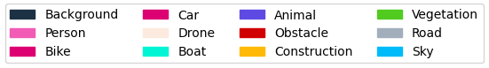
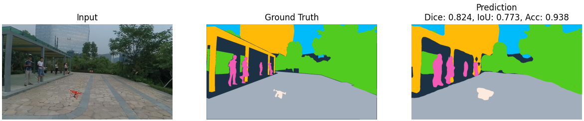
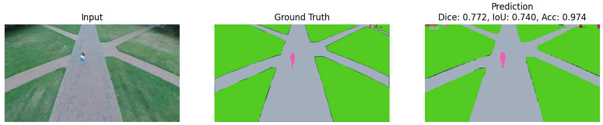
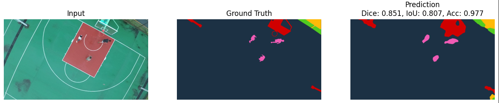
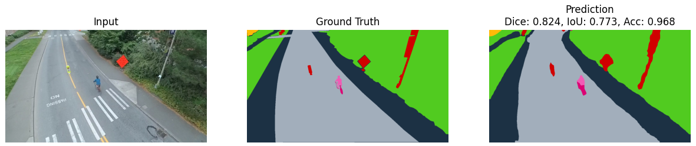
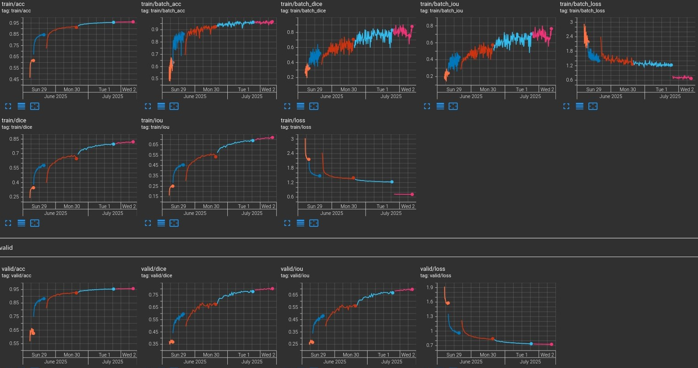
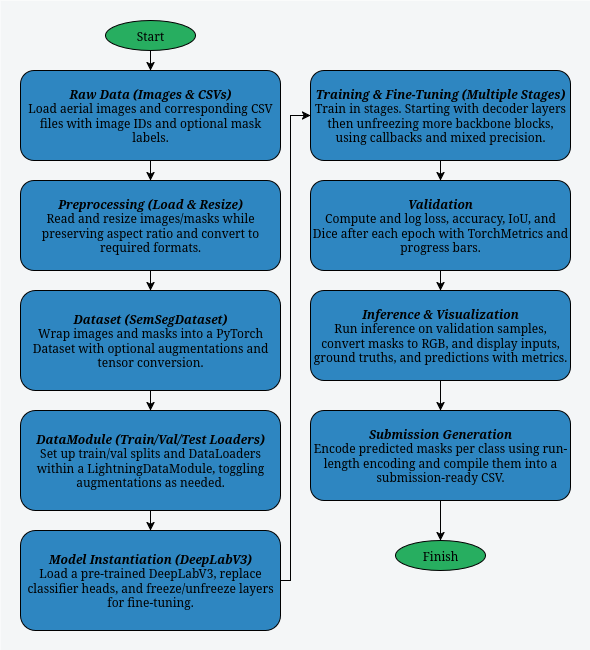

# Aerial Drone Image Segmentation

This work implements an end-to-end aerial semantic segmentation pipeline in PyTorch Lightning, with custom SemSegDataset and AerialSeg_DataModule classes handling data loading, splitting, and both color and spatial augmentations. Utility functions provide image resizing, normalization, and visualization of raw, augmented, and prediction samples alongside a legend for class-color mapping. A LightningModule built on a pre-trained DeepLabV3 backbone uses a combined Dice + Cross-Entropy loss, supports auxiliary heads, progressive fine-tuning, early stopping, and in-memory checkpointing. Finally, evaluation scripts compute Dice, IoU, and pixel accuracy, display side-by-side input/ground-truth/prediction visuals, and generate RLE-encoded submission CSVs.

---

## Example Results

Below are a few representative outputs from our aerial semantic segmentation pipeline, highlighting its ability to accurately delineate objects in unseen validation images. Each row shows the input RGB image alongside its ground-truth mask and the model’s predicted segmentation, with each class rendered in its assigned color. 

### Sample Predictions:

<div style="display: flex; justify-content: center; overflow-x: auto; width: 80%;">
  <table style="table-layout: auto; border-collapse: collapse;">
    <thead>
      <tr>
        <th style="text-align: left; padding: 8px;">Class Color Labels</th>
      </tr>
    </thead>
    <tbody>
      <tr>
        <td style="padding: 8px;">
          
        </td>
      </tr>
      <tr>
        <td style="padding: 8px;">
          
        </td>
      </tr>
      <tr>
        <td style="padding: 8px;">
          
        </td>
      </tr>
      <tr>
        <td style="padding: 8px;">
          
        </td>
      </tr>
      <tr>
        <td style="padding: 8px;">
          
        </td>
      </tr>
    </tbody>
  </table>
</div>


### Training Performance Training and Validation Dataset:

<div style="display: flex; justify-content: center; overflow-x: auto; width: 80%;">
  <table style="table-layout: auto; border-collapse: collapse;">
    <thead>
      <tr>
        <th style="text-align: left; padding: 8px;">Training Loss/Acc on Validation and Training Dataset</th>
      </tr>
    </thead>
    <tbody>
      <tr>
        <td style="padding: 8px;">
          
        </td>
      </tr>
    </tbody>
  </table>
</div>
Transfer Learning + Fine Tuning took around 78 hours on a AMD RX 6800 using half-precision.

#### Plot Legend  
- **Orange**  
  Transfer learning _without_ data augmentation (only the final convolutional layer is trained).

- **Deep Blue**  
  Fine-tuning from tbe last encoder layer to output _without_ data augmentation.

- **Red**  
  Fine-tuning from the ASPP layer to output layer with data augmentation.

- **Light Blue**  
  Fine-tuning of half MobilNet layers to output layer with data augmentation.

- **Pink**  
  Fine-tuning _all_ layers with data augmentation.

---

## What it does

- **Data Loading & Preprocessing**  
  • Reads aerial images and corresponding masks from disk  
  • Automatically resizes images while preserving aspect ratio

- **PyTorch Lightning DataModule**  
  • Wraps train/val/test splits with configurable batch size and workers  
  • Handles on-the-fly data augmentation (color jitter, flips, affine)  
  • Prepares and caches train/validation splits from a single CSV  

- **Model Architecture & Fine-Tuning**  
  • Leverages a pre-trained DeepLabV3 backbone (MobileNetV3 large)  
  • Replaces and fine-tunes classifier heads for custom number of classes  
  • Configurable “freeze-and-unfreeze” strategy via `fine_tune_start`  

- **Custom Loss & Metrics**  
  • Combines soft Dice loss with weighted Cross-Entropy (`DiceCrossEntropyLoss`)  
  • Computes per-class Dice scores and macro/micro averages (`MulticlassDiceScore`)  
  • Logs accuracy, IoU, and Dice during training and validation  

- **Training Utilities**  
  • In-memory checkpointing with periodic disk snapshots  
  • Early stopping based on validation loss  
  • Persistent rich progress bars and TensorBoard logging  

- **Visualization Helpers**  
  • Render random samples with ground-truth vs. predicted masks  
  • Color-map legend for semantic classes  
  • Overlay of Dice, IoU, and pixel-accuracy metrics on predictions  

- **Inference & Submission**  
  • Batch inference on test images returning image IDs  
  • RLE encoding of per-class masks for competition-style submissions  
  • Generates a ready-to-submit CSV file  

- **Extensible Configuration**  
  • Dataclasses for data, model, and training hyperparameters  
  • Toggle precision (16-bit mixed or 32-bit) for tensor-core speedups  
  • Easily swap backbone, augmentation, and optimizer settings

---

## Run Instructions

Clone the repository and build all projects in one step:

```bash
git clone https://github.com/sancho11/aerial_drone_image_segmenter.git
cd aerial_drone_image_segmenter
python -m venv .venv
source .venv/bin/activate  # On Windows, use: .venv\Scripts\activate
pip install -r requirements.txt
```

Get the dataset: `Instructions at get_dataset.md`


To run the project:

```bash
#For running the notebook pipeline using jupyter notebook
jupyter notebook
#For training a model using python
python train.py
#For running evaluation metrics on a trained model
python evaluate.py path/to/model
#For running classification on a single image.
python infierence.py path/to/model path/to/image
```

### Training
To get good inference results I recomend to follow this training sequence:

```bash
# 1. Transfer learning only (Last Decoder Layer)
# No checkpoint → training from scratch using defaults.
python train.py --log-name "dlv3MNl_TransferLearning(LastDecoderLayer)" --epochs 30

#2. Fine-tune last encoder-to-output layers
python train.py --no-data-augmentation --learning-rate 1e-2 --fine-tune-start 18 --load-from last --ckpt-path PATH_TO_PREV_CKPT --log-dir tb_logs --log-name "dlv3MNl_FineTunning(LastEncoderLayertoOutput)" --epochs 70

# 3. Fine-tune ASPP-layer to output
python train.py --data-augmentation --learning-rate 8e-3 --fine-tune-start 17 --load-from last --ckpt-path PATH_TO_PREV_CKPT --log-dir tb_logs --log-name "dlv3MNl_FineTunning(ASPPlayertoOutput)" --epochs 30

# 4. Fine-tune last half of MobileNet layers
python train.py --data-augmentation --learning-rate 1e-2 --fine-tune-start 8 --load-from last --ckpt-path PATH_TO_PREV_CKPT --log-dir tb_logs --log-name "dlv3MNl_FineTunning(LastHalfMobilNetLayerstoOutput)" --epochs 40

# 5. Fine-tune all layers
python train.py --data-augmentation --learning-rate 4e-3 --fine-tune-start 0 --no-aux-loss --load-from last --ckpt-path PATH_TO_PREV_CKPT --log-dir tb_logs --log-name "dlv3MNl_FineTunning(AllLayers)"  --epochs 30

```
### Evaluating
Generate confusion matrix and do inference over whole dataset
``` bash
python evaluate.py --ckpt-path /path/to/your/checkpoint.pt
```

### Inferring
Do an inference on a single image using a trained model
``` bash
python infer.py --ckpt-path ./path/to/your/checkpoint.pt --image-path /path/to/image --save-color
```

---

## Pipeline Overview
<p align="center">
  
  <br><em>Pipeline Diagram</em>
</p>


---

## Key Techniques & Notes
* **Aspect-Preserving Resize**

  * Resizes images so that the smaller edge equals a target size (e.g., 720px) while maintaining aspect ratio via `resize_keep_aspect`.
  * Ensures consistent input size with minimal distortion and efficient memory usage.

* **Custom `SemSegDataset` & DataModule**

  * **`SemSegDataset`** handles image/mask loading, optional RGB conversion, and on-the-fly augmentations.
  * **`AerialSeg_DataModule`** encapsulates split creation, normalization stats (ImageNet defaults), transform pipelines, and PyTorch Lightning–style DataLoaders for train/val/test.

* **Rich Data Augmentation**

  * **Color augmentations**: brightness, hue jitter, and histogram equalization (`ColorJitter` + `RandomEqualize`).
  * **Spatial augmentations**: random flips, affine transforms (rotation, translation, scaling) applied jointly to images and masks via TorchVision’s v2 `Compose` for consistent pixel-wise label alignment.

* **Model Architecture & Transfer Learning**

  * **Backbone**: Pre-trained DeepLabV3 with MobileNetV3-Large.
  * **Head replacement**: Replaces classifier and (optional) auxiliary heads to match the target number of classes (12).
  * **Layer freezing strategy**: Freeze entire network initially, then unfreeze in stages by specifying a `fine_tune_start` index—progressively unlocking more layers for fine-tuning.

* **Composite Loss & Custom Metrics**

  * **`DiceCrossEntropyLoss`**: Combines soft Dice loss (for class imbalance robustness) with weighted Cross-Entropy.
  * **`MulticlassDiceScore`**: PyTorch-Metrics–based macro-averaged per-class Dice implementation that handles absent classes gracefully (treating them as perfect).
  * Standard metrics: pixel accuracy, mean IoU, and per-class Dice (via custom functions for inference).

* **Training Strategy**

  * **Multi-stage fine-tuning**:

    1. Train only the final classifier layer (decoder) without augmentation.
    2. Gradually unfreeze encoder layers (last encoder block, ASPP layer, half MobilNet layers, then all layers), adjusting learning rate and enabling augmentations at each stage.
  * **Precision control**: Uses mixed-precision (`16-mixed`) for tensor-core acceleration when available.

* **Callbacks & Logging**

  * **EarlyStopping** on validation loss with configurable patience.
  * **RichProgressBarLeave**: Persistent progress bars across epochs.
  * **`InMemoryCheckpoint`**: Keeps best and last model states in memory; periodically writes to disk every 5 epochs and at training end.
  * **TensorBoardLogger**: Logs metrics for interactive visualization of training curves.

* **Visualization Utilities**

  * **`show_random_samples`**: Displays image/mask pairs with legend, optionally under augmentations.
  * **`show_predictions_with_metrics`**: Random validation samples with model predictions, overlaid Dice, IoU, and accuracy scores for qualitative inspection.